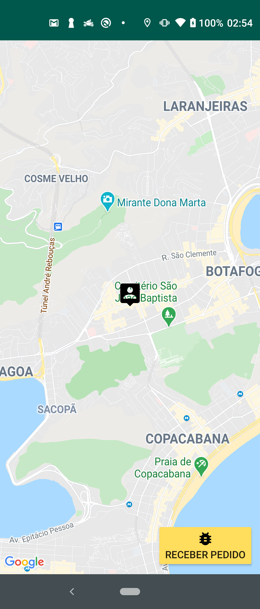
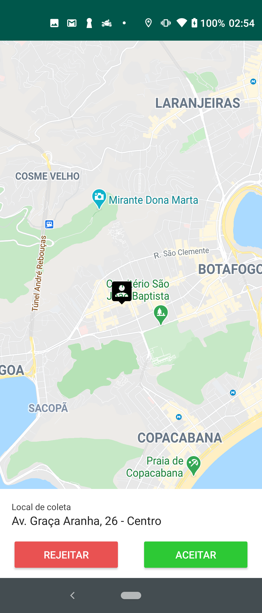
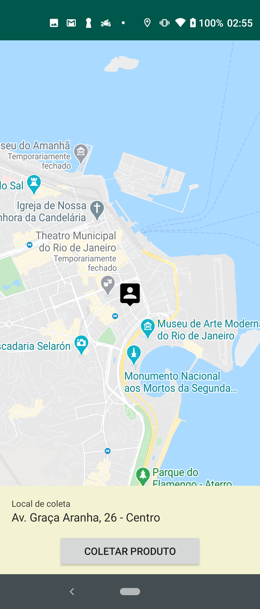
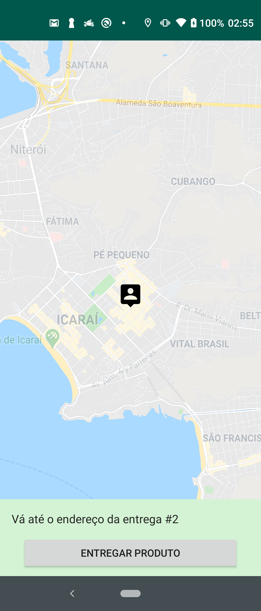
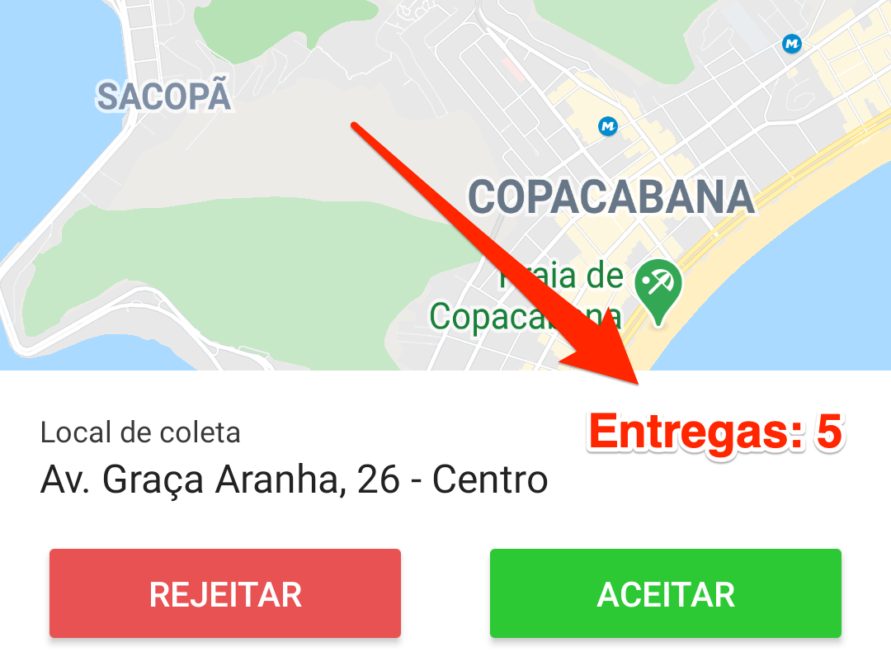
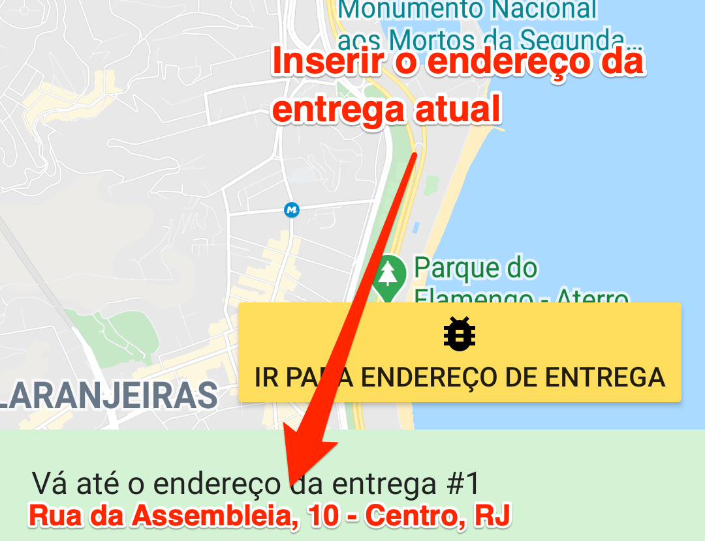
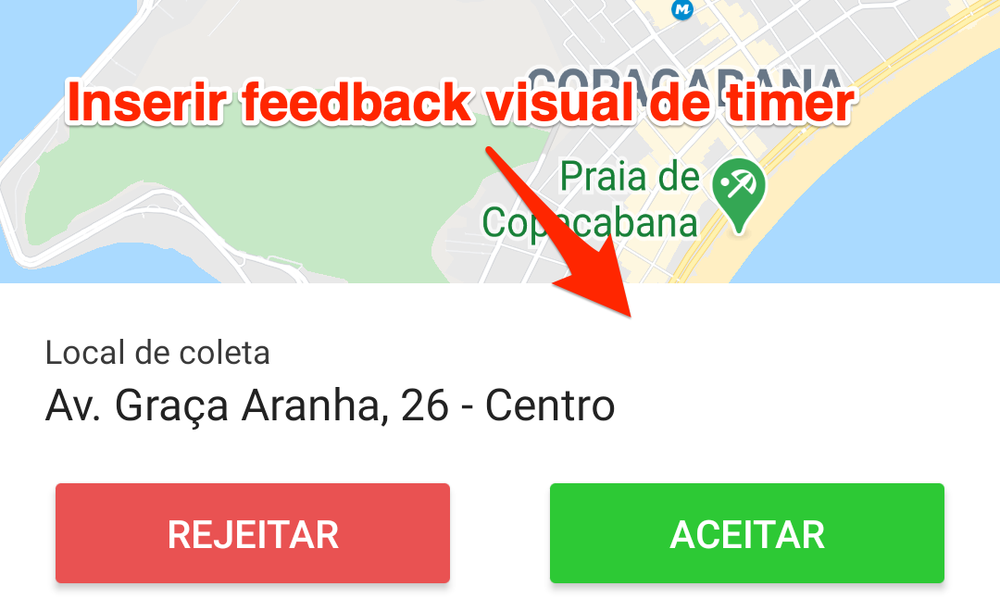
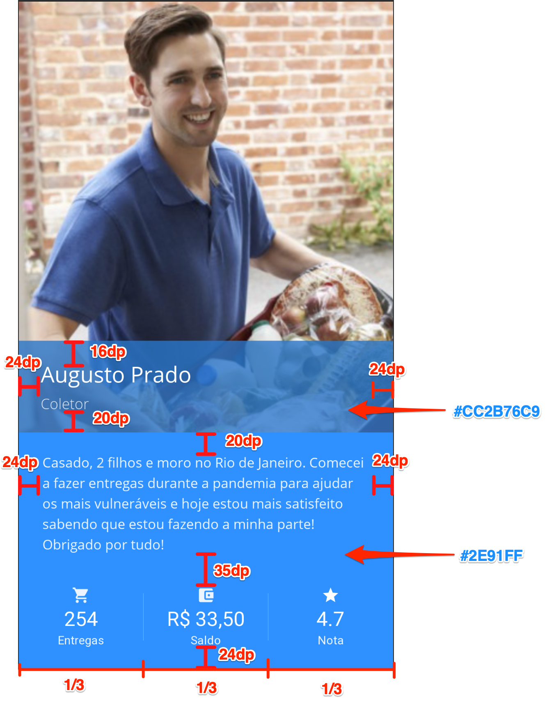

# Processo seletivo: Gaudium - Desenvolvedor Android
Bem vindo ao processo seletivo da Gaudium!

### Pré-requisitos
- Android Studio 3.5 ou superior
- Ter uma conta no GitHub
- Ter uma cópia deste repositório a partir do botão "Use this template" e convidar o usuário gaudiumtecnicos@gmail.com ao repositório criado
- Git instalado para fazer os commits do código no repositório próprio ao longo da prova
    - Caso tenha dificuldades, recomendamos usar o GitHub Desktop
- Internet estável 

## O desafio
Um empresário interessado em atuar no ramo de delivery quer lançar seu próprio app no mercado e dominar as entregas de sua região. Seu aplicativo já existe, mas está incompleto. Ele contratou uma empresa que cobrou barato e prometeu muito, e o resultado foi que eles sumiram sem dar satisfação e deixaram algumas coisas incompletas.

Para resolver seu problema, e não passar pelo mesmo sufoco duas vezes, ele escolheu uma ótima empresa de desenvolvimento de software, Gaudium, para lhe ajudar a realizar o seu sonho de ter um aplicativo tão bom quanto o da concorrência. Assim, ele fica tranquilo em relação à qualidade enquanto pode se dedicar na sua marca.
Entretanto, devido ao golpe que levou, ele contratou apenas algumas poucas horas de desenvolvimento para medir se vale o investimento ou não.

A implementação das melhorias foi dividida em três etapas. Seu desafio será fazer uma boa gestão de tempo para agregar o máximo de valor, com qualidade, ao produto final dentro do tempo contratado.

## Introdução

### O código atual
O código segue o modelo MVP padrão do Android e possui apenas uma tela, a MapsActivity. Essa tela se adapta de acordo com sua máquina de estados, exibindo em uma view os dados e as ações relevantes para cada estado.
O estado atual do entregador fica armazenado na classe EntregadorObj e utiliza os Enums contidos no arquivo StatusEntregadorEnum para controlar o comportamento do app, sendo eles:

#### Disponível
É o estado inicial do aplicativo. Ele representa o usuário (entregador) que está disponível para receber novas ofertas de entrega.




#### Decidindo
Nesta etapa, o entregador visualiza uma oferta de entrega disponível que chegou até ele. Caso ele queira realizar a entrega, deve apertar o botão *Aceitar*. Caso não queira, *Rejeitar*.
Ao aceitar uma oferta, ele vai para o estado Colentado. Caso rejeite, volta para o estado disponível.



#### Coletando
A etapa de coleta representa o momento que o entregador está se locomovendo para o endereço de coleta, seja ele um mercado, estabelecimento, armazém, etc. O aplicativo exibe o endereço que o entregador deve se direcionar e, quando está próximo do endereço exibido, aparece também um botão de Coletar.
Ao apertar o botão Coletar, o entregador está confirmando que coletou o item a ser entregue e agora avança para o estado Entregando.



#### Entregando
Enquanto está entregando o entregador visualiza apenas o endereço que deve ser entregue. A tela indica qual o pedido ele deve entregar no momento e, quando próximo do endereço, exibe um botão para confirmar a entrega e avançar. Ao confirmar a entrega, o entregador passará a ver o próximo endereço da lista de entregas. Ao confirmar o último endereço, o app emitirá um som diferente informando que o pedido foi finalizado e voltará para o estado Disponível.




### Botão de debug

Para auxiliar no desenvolvimento, foi inserido um botão que realiza as ações necessárias para avançar em cada estado.
- No estado **DISPONÍVEL** o botão fará com que uma oferta de pedido chegue até o aparelho, como se alguém realmente estivesse solicitando.
- No estado **COLETANDO**, o botão irá transportar a localização do entregador para perto do endereço de coleta, para que este consiga avançar para o próximo estado.
- No estado **ENTREGANDO**, o botão irá transportar a localização do entregador para perto do endereço de entrega da vez, para que este consiga avançar para o próximo endereço ou finalizar as entregas.

## O desafio
### Instruções
Você deverá clonar o repositório atual em um repositório próprio.
Além disso, deverá convidar o usuário `gaudiumtecnicos@gmail.com` para o seu repositório que ficará com o código da prova.
Ao final de cada item concluído você deverá fazer um commit da alteração e, na descrição do commit, explicar o que foi feito e qual foi a motivação para as decisões tomadas. Após realizar o commit, **não se esqueça de fazer o push.**

### Etapa zero
Alterar o marcador do passageiro para um onde o fundo é branco. O marcador atual é o `pin_user.xml`, que possui um fundo transparente. A primeira tarefa será trocar o `pin_user.xml` pelo `pin_user_white.xml`, que é melhor de visualizar no mapa.
Ao finalizar essa etapa inicial, vamos fazer um commit deixando claro qual etapa resolvemos e, na descrição, explicar como chegou na solução enviada.
Ex: 

> **Summary:** Etapa zero: Mudança de imagem utilizada no pin do usuário

> **Description:** Como foi solicitado pelo cliente a troca de uma imagem com um nome específico, procurei pelo código qualquer referência à essa imagem, "pin_user", e alterei onde foi encontrado, conforme o solicitado.

### 1ª etapa - Acesso à API real <!-- 30 minutos -->
A primeira etapa possui a parte mais importante a ser implementada, que é a comunicação com o servidor da aplicação.
O app foi entregue sem uma biblioteca de comunicação web funcional, e o único serviço que está sendo utilizado, `OfertaPedidoWebService`, retorna uma estrutura fixa de pedido ao invés de carregar os dados do servidor e adaptar a essa estrutura. 
O primeiro desafio é fazer com que o app obtenha os dados através das APIs ao invés das estruturas *hard-coded*.

#### Detalhes da alteração
A api que deve ser chamada é a `/ps/ofertaPedido` e já se encontra declarada na variável `URL`, no arquivo `OfertaPedidoWebService.java`. Nesta classe existe um comentário que simula a chamada ao serviço. Para funcionar, será necessário replicar essa lógica em uma biblioteca de comunicação qualquer de sua escolha, mantendo as melhores práticas para a implementação de uma chamada a um serviço web, e retornar o objeto obtido, como faz o comentário no código.
A api retorna uma resposta no formato JSON que respeita a seguinte estrutura:
- `endereco_coleta`, com o endereço do local de coleta já formatado
- `lat_coleta`, com a latitude do local de coleta
- `lng_coleta`, com a longitude do local de coleta
- `entrega`, que é um array de entregas (sem limite de elementos)

Cada objeto no array de entrega contém:
- `endereco`, que exibe o endereço do local da entrega já formatado
- `lat`, com a latitude do local da entrega
- `lng`, com a longitude do local da entrega

url: https://dbgapi-desenv.taximachine.com.br/ps/ofertaPedido.php
```json
{
    "success":"<String contendo "true" ou "false">",
    "response":{
        "endereco_coleta":"<String contendo o endereço de coleta>",
        "lat_coleta":"<double com a latitude do endereço de coleta>",
        "lng_coleta":"<double com a longitude do endereço de coleta>",
        "entrega":[
            {
                "lat":"<double com a latitude do endereço para entrega>",
                "lng":"<double com a latitude do endereço para entrega>",
                "endereco":"<String contendo o endereço para entrega>"
            },
            ...
        ]
   }
}   
```

### 2ª etapa - Pequenas melhorias da funcionalidade principal
Agora que a conexão à internet já está funcionando, o cliente deseja inserir novas funcionalidades para bombar o seu app. Caso encontre dificuldade, pode pular alguns detalhes e avançar.
Segue abaixo a lista de demandas do cliente:

#### 2.1 Quantas entregas vão ser, 1 ou 20? <!-- 10 minutos -->
O entregador vai ficar inseguro ao receber um pedido e não saber se vai ser rápido ou demorado. Sendo assim, precisamos exibir a quantidade de entregas na tela de `Oferta`, conforme a imagem abaixo:



#### 2.2 O entregador precisa saber pra onde vai <!-- 15 minutos -->
Na etapa **ENTREGANDO**, exibir o endereço da entrega atual abaixo da mensagem *"Vá até o endereço do pedido"*



**Dica:** O endereço da entrega não está na estrutura *hard-coded*, mas também é retornado pela API chamada. Faça os devidos ajustes para utiliza-lo nesta tarefa.

#### 2.3 Ofertas não podem durar para sempre <!-- 25 minutos -->
No menu com as opções de Rejeitar ou Aceitar, que é exibido no estado *Decidindo* do objeto entregador, inserir um timer de 15 segundos com feedback visual para a oferta sumir, permitindo que o usuário acompanhe o progresso do tempo restante. Após esse tempo, voltar o entregador para o estado *Disponível*.



 <!-- Total até aqui: 80 min -->
 
### 3ª etapa - Nova tela para mostrar os dados do entregador e o histórico
O cliente deseja que os entregadores possam verificar o seu perfil, e que nela exiba algumas estatísticas como a quantidade de entregas, saldo e nota média. Nesta etapa seu trabalho será de criar essa tela de acordo com um layout e depois preencher com os dados desejáveis obtidos através de uma api.

#### 3.1 Tela de perfil do entregador <!-- 60 minutos -->
Criar a tela de Perfil conforme a imagem abaixo:


    
A tela possui as seguintes regras:
- Os dados são exibidos no final da tela
- A foto do entregador preenche o espaço faltante entre o topo da tela até a view contendo a descrição do perfil, ficando atrás da view semi-transparente. 
- A foto do entregador será fixa e já está presente no projeto com o nome `img_entregador.png`
- Os 3 indicadores inferiores ocupam igualmente toda a largura da tela, e cada um está centralizado dentro de seu espaço. Entre eles existe uma view de `3px` na cor `#82B4FE`.
- As imagens utilizadas pelos 3 indicadores já estão presentes no projeto e podem ser encontradas a partir dos nomes, na ordem de exibição da imagem:
     - `ic_entregas.xml`
     - `ic_saldo.xml`
     - `ic_nota.xml`
- As margens relevantes estão especificados na imagem abaixo. Caso alguma margem não esteja definida, fique à vontade para decidir a mais apropriada.



As cores utilizadas pelos menus são as seguintes:
- View semi-transparente: `#CC2B76C9`
- View inferior: `#2E91FE`
- Separador entre as estatísticas: `#82B4FE`

Para os textos da tela, seguem as fontes e tamanhos que devem ser utilizados:
- O nome do entregador (Augusto Prado) usa a fonte `open_sans`, já existente no projeto, com tamanho de `24sp` na cor `#FFFFFF`
- O cargo (Coletor) usa a fonte `open_sans_light`, já existente no projeto, com tamanho `16sp` na cor `#DFE9F7`
- A descrição do perfil usa a fonte `open_sans`, já existente no projeto, com tamanho `15sp` na cor `#ECF4FF`. O espaço entre as linhas da descrição possuem um espaçamento extra de `2dp`
- Para os 3 indicadores inferiores:
    - O número deverá utilizar a fonte `roboto`, default do android, com tamanho `22sp` e cor `#FFFFFF`
    - O nome do indicador deverá utilizar a fonte `roboto`, default do android, com tamanho `13sp` e cor `#ECF4FF`
     


#### 3.2 Como devo chegar nessa tela? <!-- 10 minutos -->
Inserir em algum lugar da tela principal do app uma forma de acessar essa nova tela de perfil. Colocar no lugar que você achar mais interessante pro usuário final (entregador) acessar.

#### 3.3 Perfil hard-coded não faz sentido <!-- 30 minutos -->
Já pensou em gerar 1 app para cada usuário? Vai dar trabalho e não é escalável. Sendo assim, você deve consumir a API `/ps/perfil` para obter os dados referentes a esse entregador (nome, cargo, descrição) e preencher nos devidos locais da tela.

A API `/ps/perfil` retorna os seguintes dados:
- `success`, indicando se funcionou ou não
- `response`, com os dados solicitados
- `nome`, com o nome do entregador
- `cargo`, com o cargo referente ao entregador
- `descricao`, texto contendo a descrição do perfil
- `historico`, que é um array de histórico (sem limite de elementos). Cada elemento no array de histórico possui os seguintes atributos:
    - `quando`, com a data da entrega realizada
    - `valor`, em float, com quanto ganhou nessa entrega
    - `qtd`, em int, com o número de entregas que fez no pedido
    - `avaliacao`, em int, com a nota recebida pela entrega realizada

Segue a estrutura:
url: https://dbgapi-desenv.taximachine.com.br/ps/perfil.php
```json
{
    "success":"<String contendo "true" ou "false">",
    "response":{
        "nome":"<String com nome do entregador>",
        "cargo":"<String com nome do cargo do entregador>",
        "descricao":"<String com a descrição do perfil>",
        "historico":[
            {
                "quando":"<String com a data da entrega>",
                "valor":"<Float com o valor ganho pela entrega>",
                "qtd":"<Integer com a quantidade de produtos entregues na entrega>",
                "avaliacao":"<Integer com a avaliação recebida pela entrega>"
             },
             {
                "quando":"<String com a data já pronta para visualização>",
                "valor":"<Float com o valor ganho pela entrega>"
            },
            ...
        ]
    }
}
```

#### 3.4 As estatísticas precisam ser calculadas <!-- 20 minutos -->
Se olhar para a resposta da API, não vai ter informações claras sobre saldo, avaliação do motorista e nem quantidade total de entregas, mas tem o histórico dele. A partir dos dados recebidos no histórico, calcule e preencha os seguintes indicadores:
    - Quantidade total de produtos entregues
    - Média de avaliações das entregas
    - Saldo, em reais, com o total recebido. O valor deverá ser formatado para ser exibido de acordo com as regras da moeda Real.
    
 <!-- Total até aqui: 200 min -->
### Conclusões
Enfim, boa sorte e boa prova! :)
